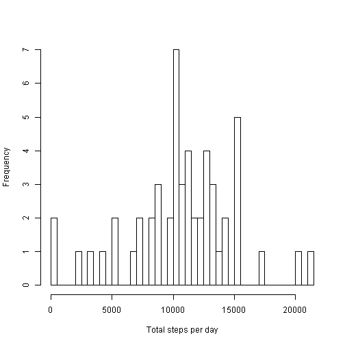
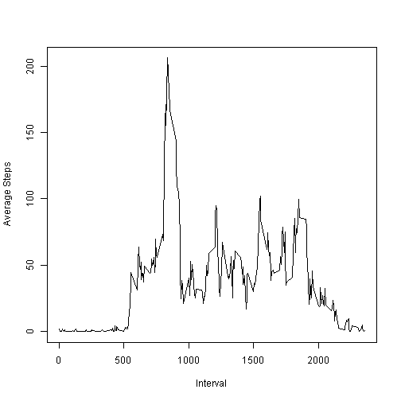
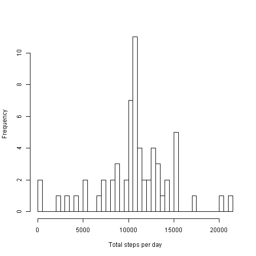
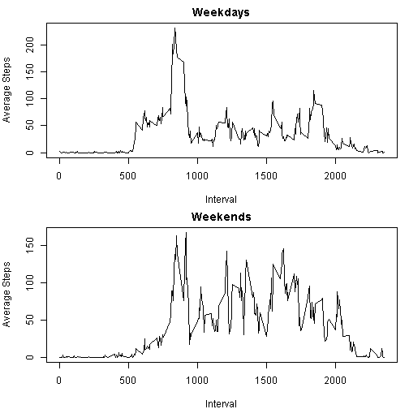

###Introduction

It is now possible to collect a large amount of data about personal movement using activity monitoring devices such as a Fitbit, Nike Fuelband, or Jawbone Up. These type of devices are part of the "quantified self" movement - a group of enthusiasts who take measurements about themselves regularly to improve their health, to find patterns in their behavior, or because they are tech geeks. But these data remain under-utilized both because the raw data are hard to obtain and there is a lack of statistical methods and software for processing and interpreting the data.

This assignment makes use of data from a personal activity monitoring device. This device collects data at 5 minute intervals through out the day. The data consists of two months of data from an anonymous individual collected during the months of October and November, 2012 and include the number of steps taken in 5 minute intervals each day.


###Data

The data can be downloaded from the course web site:

Dataset: [Activity monitoring data](https://d396qusza40orc.cloudfront.net/repdata%2Fdata%2Factivity.zip)

The variables included in this dataset are:

- steps: Number of steps taking in a 5-minute interval (missing values are coded as NA)
- date: The date on which the measurement was taken in YYYY-MM-DD format
- interval: Identifier for the 5-minute interval in which measurement was taken

The dataset is stored in a comma-separated-value (CSV) file and there are a total of 17,568 observations in this dataset.


###Loading and Preprocessing Data

The code snippets below are used to load the full dataset and display the first 10 rows.

```r
#the ZIP file containing the data set needs to be downloaded and unzipped to the working directory

activity<-read.csv("~\\activity.csv")
head(activity, n = 10)
```

```
##    steps       date interval
## 1     NA 2012-10-01        0
## 2     NA 2012-10-01        5
## 3     NA 2012-10-01       10
## 4     NA 2012-10-01       15
## 5     NA 2012-10-01       20
## 6     NA 2012-10-01       25
## 7     NA 2012-10-01       30
## 8     NA 2012-10-01       35
## 9     NA 2012-10-01       40
## 10    NA 2012-10-01       45
```

The data will now be analyzed to answer the questions raised in the assignment.


###What is mean total number of steps taken per day?

To begin answering this question, the total number of steps taken each day needs to be determined. The missing (NA) values will be ignored in this question and will be addressed later. The total sums of the *steps* taken on each *date* can be done using the **aggregate()** function on the data set in the code below: 

```r
totalbydate <- aggregate(activity$steps, list(activity$date), sum)
names(totalbydate) <- c("date", "total_steps")
```

The sums of the steps for each day can be viewed by examining the **totalbydate** object. 


```r
head(totalbydate)
```

```
##         date total_steps
## 1 2012-10-01          NA
## 2 2012-10-02         126
## 3 2012-10-03       11352
## 4 2012-10-04       12116
## 5 2012-10-05       13294
## 6 2012-10-06       15420
```

For a better visual representation of the distribution of the number of total steps for each day, a plot can be constructed:

```r
totalbydate$total_steps = as.numeric(totalbydate$total_steps)
hist(totalbydate$total_steps, breaks = 61, xlab = "Total steps per day", main = "")
```

 

Finally, the central tendency measures of *mean* and *median* of the total sums can be determined using the following code snippets:


```r
mean(totalbydate$total_steps, na.rm = TRUE)
```

```
## [1] 10766.19
```

```r
median(totalbydate$total_steps, na.rm = TRUE)
```

```
## [1] 10765
```


###What is the average daily activity pattern?

The activity pattern in terms of *steps* will now be determined by 5-minute *intervals* averaged accross all *dates* on the dataset. 


```r
avebyint = aggregate(activity$steps, list(activity$interval), mean, na.rm = TRUE)
names(avebyint) = c("interval", "average_steps")
```

The averages can be plotted against each interval below for a visual representation of activity patterns:

```r
plot(avebyint$interval, avebyint$average_steps, type="l", ylab="Average Steps", xlab= "Interval")
```

 

####Which 5-minute interval, on average across all the days in the dataset, contains the maximum number of steps?

The following code snippet will show the 5-minute interval the contains, on average, the maximum number of steps:

```r
subset(avebyint, avebyint$average_steps == max(avebyint$average_steps), select = interval)
```

```
##     interval
## 104      835
```


###Imputing missing values

The previous questions will now be re-examined by imputing the missing (NA) values on the dataset. The number of observations with missing (NA) values can be calculated using the code below: 

```r
sum(is.na(activity$steps))
```

```
## [1] 2304
```

The method of imputing NA values will be to determine the average values of the number of *steps* for each *interval* and assign them to the *steps* with NA values on the rows with the same *interval*. 

The rows with the NA values will first be separated from the original dataset. Then the NA values will be replaced by average *steps* from the corresponding *interval*.

```r
actNA = activity[is.na(activity$steps), ] 
actNA$steps <- rep(avebyint$average_steps, 8)
```

The new dataset **activity2** will be created by joining the rows without NA values from the orginal dataset with the rows containing the imputed values for *steps*. 

```r
activity2 <- rbind(actNA, activity[!is.na(activity$steps), ] )
head(activity2, n=10)
```

```
##        steps       date interval
## 1  1.7169811 2012-10-01        0
## 2  0.3396226 2012-10-01        5
## 3  0.1320755 2012-10-01       10
## 4  0.1509434 2012-10-01       15
## 5  0.0754717 2012-10-01       20
## 6  2.0943396 2012-10-01       25
## 7  0.5283019 2012-10-01       30
## 8  0.8679245 2012-10-01       35
## 9  0.0000000 2012-10-01       40
## 10 1.4716981 2012-10-01       45
```

To revisit a previous question on the assignment using the new dataset **activity2**, a histogram can be made of the total number of steps taken each day and the mean and median of the total number of steps taken per day can be calculated.


```r
totalbydate2 = aggregate(activity2$steps, list(activity2$date), sum)
names(totalbydate2) = c("date", "total_steps")
totalbydate2$total_steps = as.numeric(totalbydate2$total_steps)
hist(totalbydate2$total_steps, breaks = 61, xlab = "Total steps per day", main = "")
```

 

```r
mean(totalbydate2$total_steps, na.rm = TRUE)
```

```
## [1] 10766.19
```

```r
median(totalbydate2$total_steps, na.rm = TRUE)
```

```
## [1] 10766.19
```

As is observed on the results above, imputing the NA values to the orginal dataset had a negligible to the measures of the *mean* and the *median* measures of the orginal dataset. The histogram plot reveals that frequency of the total *steps* per day that is equal to the mean of the total increased.


###Are there differences in activity patterns between weekdays and weekends?

To answer this question, the new dataset **activity2** that contains no missing values will be used. A new factor variable will be created in the dataset with two levels - "weekday" and "weekend" indicating whether a given date is a weekday or weekend day.

```r
activity2$date <- as.POSIXct(activity2$date, format="%Y-%m-%d")
days <- weekdays(activity2$date)
activity3 <- cbind(activity2, days)
levels(activity3$days) <- c("weekday", "weekday", "weekend", "weekend", "weekday", "weekday", "weekday")
```

Then, a panel plot will be created containing a time series plot (i.e. type = "l") of the 5-minute interval (x-axis) and the average number of steps taken, averaged across all weekday days or weekend days (y-axis).

```r
avebyint3 <- aggregate(subset(activity3, activity3$days == "weekday", select = steps), 
                       subset(activity3, activity3$days == "weekday", select = interval), mean)

avebyint4 <- aggregate(subset(activity3, activity3$days == "weekend", select = steps), 
                       subset(activity3, activity3$days == "weekend", select = interval), mean)

par(mfrow = c(2, 1), mar = c(4, 4, 2, 1))
  plot(avebyint3$interval, avebyint3$steps, type="l", ylab="Average Steps", xlab= "Interval", main = "Weekdays")
  plot(avebyint4$interval, avebyint4$steps, type="l", ylab="Average Steps", xlab= "Interval", main = "Weekends")
```

 

As is evident above, comparing the plots of activity patterns for weekdays and weekends reveal significant differences.
